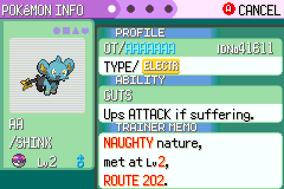

# Hidden abilities

## What changed

Pokémon can have a third, **hidden ability**, as in Generation V onwards. A
Pokémon with one shows it on its summary screen and uses it in battle like any
other ability.

- **Wild Pokémon** have their hidden ability 1 time in 20, if their species has one.
- **Eggs** get the hidden ability 60% of the time when the mother has hers. When
  breeding with Ditto, the other parent passes it on instead, whatever its
  gender (the Generation VI rule). A father's hidden ability is never passed on
  otherwise.
- Eggs keep the hidden ability when they hatch.

Only official hidden abilities that already exist in the game are used, so 261
species have one now that the {doc}`Generation IV abilities <gen4-abilities>`
are in. The rest have a comment in `species_info.h` naming the official one
(`// Hidden ability not yet in the game: Sheer Force`), so they can be filled in
as those abilities are added. They're all Generation V or later abilities.

## Where it lives

| What | Where |
| --- | --- |
| Hidden ability per species, the third entry of `.abilities` | `src/data/pokemon/species_info.h` |
| `ABILITY_SLOT_HIDDEN`, `NUM_ABILITY_SLOTS` | `include/constants/pokemon.h` |
| `WILD_HIDDEN_ABILITY_CHANCE` (1 in N), `EGG_HIDDEN_ABILITY_CHANCE` (percent) | `include/constants/pokemon.h` |
| Which slot a Pokémon uses | `MON_DATA_ABILITY_NUM`: 0, 1 or `ABILITY_SLOT_HIDDEN` |
| Slot to ability | `GetAbilityBySpecies` in `src/pokemon.c` |
| Wild chance | `TryGiveWildHiddenAbility` in `src/wild_encounter.c` |
| Breeding | `InheritHiddenAbility` in `src/daycare.c` |
| Hatching keeps it | `CreateHatchedMon` in `src/egg_hatch.c` |

A species' abilities are listed as `{first, second, hidden}`:

```c
.abilities = {ABILITY_INTIMIDATE, ABILITY_NONE, ABILITY_GUTS},
```

A Pokémon's slot is stored in two places, because the bitfield holding the
first two slots has no room to grow: `abilityNum` picks between the first two,
and a `hiddenAbility` bit (taken from the unused ribbon bits) marks the hidden
one. `MON_DATA_ABILITY_NUM` reads and writes both as a single 0–2 value, so code
outside `pokemon.c` doesn't need to know about the split. If a Pokémon has a
slot its species leaves empty (say, the hidden slot after evolving into a
species without one), it falls back to its first ability.

To give a scripted Pokémon its hidden ability, set the slot after creating it:

```c
u8 abilityNum = ABILITY_SLOT_HIDDEN;
SetMonData(mon, MON_DATA_ABILITY_NUM, &abilityNum);
```



## Upstream credit

The hidden abilities come from
[pokeemerald-expansion](https://github.com/rh-hideout/pokeemerald-expansion)'s
species data.
