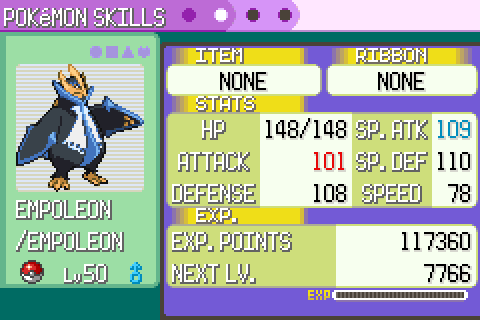

# Nature stat colours

## What changed

The summary screen's stats page shows the stat a Pokémon's nature raises in
red and the one it lowers in blue, as in later games.

## Where it lives

`BufferStat`, `BufferLeftColumnStats` and `BufferRightColumnStats` in
`src/pokemon_summary_screen.c`. The colours are text colour codes from the
summary screen's palette 6: `{COLOR}{05}` (red) for raised, `{COLOR}{08}` (blue)
for lowered and `{COLOR}{01}` for the rest.

## Upstream credit

The pokeemerald wiki's
[Colored stats by nature in summary screen](https://github.com/pret/pokeemerald/wiki/Colored-stats-by-nature-in-summary-screen),
from DizzyEgg's `nature_color` branch.
