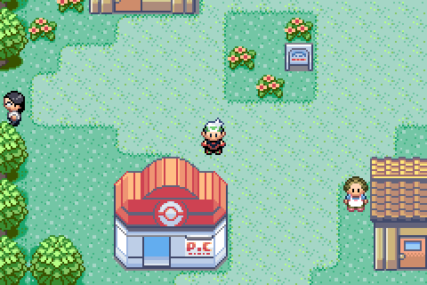
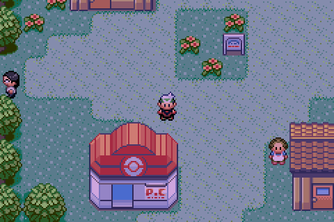
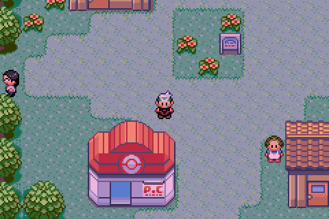
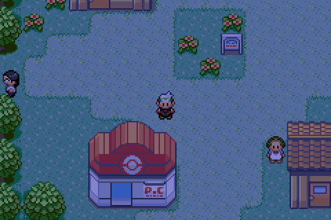

# Time of day

## What changed

The day is split into four periods, and the game reacts to them:

| Period | Hours | Real time at 60× |
| --- | --- | --- |
| Morning | 06:00–09:59 | 4 minutes |
| Day | 10:00–16:59 | 7 minutes |
| Evening | 17:00–19:59 | 3 minutes |
| Night | 20:00–05:59 | 10 minutes |

- **The overworld darkens at night.** Outdoor maps brighten over the first hour
  of the morning, darken over the first hour of the evening, and stay dark from
  18:00 until morning. Battles fought outdoors darken their background to match.
- **Day and night evolutions follow the same periods.** Morning and day count as
  day (Espeon); evening and night count as night (Umbreon). Vanilla used 12:00–23:59
  as day and 00:00–11:59 as night.
- **Maps can have different wild Pokémon by time of day.** Every outdoor map
  with wild Pokémon has a table for each period, currently all copies of the
  vanilla table — see "Time-based encounters" below.
- **A new game starts at 10:00**, so the player isn't in the dark before setting
  the bedroom clock.

These build on the {doc}`fast in-game clock <fake-rtc>`, but work the same way
with the cartridge clock.

Day, dawn (06:20), dusk (17:30) and night in the town that is now Sandgem Town,
taken before it was redrawn from Emerald's Oldale Town layout.

## Where it lives

| What | Where |
| --- | --- |
| Period constants (`TIME_MORNING`…, `*_HOUR_BEGIN`) | `include/constants/time_of_day.h` |
| `GetTimeOfDay`, `GetTimeOfDayForHour` | `src/rtc.c` |
| Tint, and the `DAY_NIGHT_TINT` flag | `src/day_night.c`, `include/config.h` |
| Tint hooks | `OverworldBasic` in `src/overworld.c`, `BattleMainCB2` in `src/battle_main.c`, `TransferPlttBuffer` and `BeginNormalPaletteFade` in `src/palette.c` |
| Day/night evolutions | `GetEvolutionTargetSpecies` in `src/pokemon.c` |
| Time-based wild encounters | `GetCurrentMapWildMonHeaderId` in `src/wild_encounter.c` |
| New-game start time | `NewGameInitData` in `src/new_game.c` |

Change the period boundaries in `include/constants/time_of_day.h`; the tint,
evolutions and encounters all read from there.

## How the tint works

Every frame in the overworld and in battle, `DayNight_UpdateTint` copies the
faded palette buffer into a separate tinted buffer, darkening each colour
channel by a filter. VBlank then sends the tinted buffer to palette RAM instead
of the faded one. The game's own palette buffers are never changed, so fades,
weather and everything else that edits palettes carry on as normal underneath.

- **Not tinted:** indoor, underground and secret base maps, and every other
  screen (menus, the bag, the party screen and so on).
- **In the overworld**, everything is tinted except background palettes 13–15,
  which hold the text boxes and menus.
- **In battle**, only background palettes 2–4 (the battle background) are
  tinted. The Pokémon, trainers, text box and health boxes are left alone.
- The clock is re-read once a second. During the day no work is done at all.

Set `DAY_NIGHT_TINT` to `FALSE` in `include/config.h` to turn it off.

Adapted from Ashingda's
[Day Night System](https://github.com/Ashingda/pokeemerald-public/wiki/Day-Night-System/)
tutorial, itself based on Xhyz's dns. The filter values are the tutorial's.
Changes from the tutorial:

- It doesn't include the tutorial's own clock, which Palladium's fake clock replaces.
- It doesn't include the lit windows at night. Those recolour fixed palette slots,
  which only line up with windows in some tilesets. In Mauville and Slateport they
  would recolour the wrong things.
- In battle it tints only the battle background. The tutorial also tints some
  UI and link-battle palettes.
- It precomputes each filter into lookup tables and skips the work entirely
  during the day, instead of multiplying every colour every frame.
- It fixes an out-of-bounds read in the tutorial's sprite palette check.

## Time-based encounters

Every map with wild Pokémon except caves and interiors (`MAP_TYPE_UNDERGROUND`
and `MAP_TYPE_INDOOR`) has four encounter tables, named after the map with
`_Morning`, `_Day`, `_Evening` and `_Night` on the end — for example
`gRoute101_Night`. They start out as identical copies of the vanilla table, so
nothing changes until they're edited. In Porymap, they show up as four encounter
groups on the map's Wild Pokémon tab.

A map's tables are used in the order they're listed in
`src/data/wild_encounters.json`:

| Tables for the map | Used |
| --- | --- |
| 1 | Always (vanilla behaviour) |
| 2 | Morning and day, then evening and night |
| 4 | Morning, day, evening, night |

Any other number of tables uses only the first. Altering Cave keeps its own
table selection. Each table can include any mix of land, water, rock smash and
fishing encounters.

Based on the
[Adding Time Based Encounters](https://github.com/pret/pokeemerald/wiki/Adding-Time-Based-Encounters)
tutorial, with the table lookup rewritten so the tables don't need to be
adjacent and maps with other table counts are unaffected.
